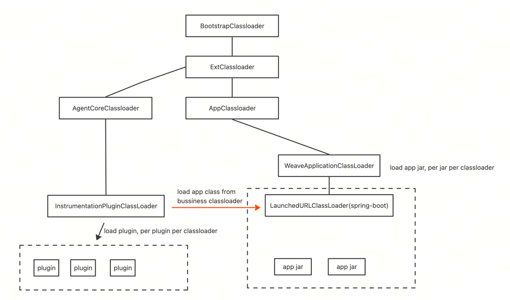

# jweave
jweave是一个简单轻量的javaagent框架，通过字节码技术实现类与逻辑的动态修改。
实现上充分使用了javaagent普遍采取的类隔离技术来避免冲突问题，并提供了友好的插件拓展体系用于自定义拓展。

## 插件体系
### 字节码增强
通过`TypeInstrumentation`接口来拓展字节码增强逻辑
```
public interface TypeInstrumentation {
    //定义对哪个类增强
    ElementMatcher<TypeDescription> typeMatcher();
    //定义对具体的哪些方法增强
    MethodAdvice[] methodAdvices();
    //在类加载javaagent机制即将transform时做一些准备工作
    default void prepare(ClassLoader bussinessCl, ClassLoader pluginCl){}
}
```
提供一个简单的例子
 ```
//SPI机制会自动加载这个类增强的定义
@AutoService(TypeInstrumentation.class)
public class DubboInboundInstrumentation implements TypeInstrumentation {
    @Override
    public ElementMatcher<TypeDescription> typeMatcher() {
        return ElementMatchers.named("xx.Test");
    }

    @Override
    public MethodAdvice[] methodAdvices() {
        return new MethodAdvice[]{
                MethodAdvice.of(ElementMatchers.named("test"), TestAdvice.class.getName())
        };
    }
}

public class TestAdvice {
    @Advice.OnMethodEnter(suppress = Throwable.class)
    public static void enter(@Advice.Argument(0) String str, @Advice.This Object obj) {
        System.out.println("before method");
    }
    
    @Advice.OnMethodExit(suppress = Throwable.class)
    public static void exit(@Advice.Argument(0) String str, @Advice.This Object obj) {
        System.out.println("after method");
    }
}
```
以上的例子中，定义了一个类增强，对Test类中的test方法进行增强，在方法执行前打印"before method"，在方法执行后打印"after method"。    
其中Advice以及类型匹配都是bytebuddy这个字节码框架的api，这里没有像skywalking、sermant这类agent一样做进一步的封装，提供类似aop的api，供用户实现方法执行前、执行后等逻辑。
进一步封装的好处是可以让用户以一种更简单的api实现增强逻辑而不需要知道背后的bytebuddy，但坏处就是丢失了bytebuddy的底层能力。
例如你在类内部想修改一个private变量，如果这个属性没有提供public的修改方法，那就只能使用反射了；试想我们自己写代码在类内部修改一个变量的属性其实轻而易举的事情，直接使用bytebuddy可以保留更多这种基础能力。
不同场景下的javaagent字节码修改逻辑会千奇百怪，jweave会更看重字节码操作覆盖各种场景的能力，所以这里保留了bytebuddy的原始使用方式。
### 插件后台服务
通过BootService来定义插件自己的服务实现，通过一些列的生命周期方法，你可以在插件里实现任意的逻辑，引入任意的类库而不用担心和原始应用代码冲突的问题。
例如你可以在插件中通过http\grpc等协议实现连接到一个自己的控制台，由于有完善的类隔离机制所以你完全不需要担心http\grpc等这类client的包冲突问题。
```
public interface BootService {
    String name();

    void start();

    void stop();

    default int priority() {
        return 0;
    }
}
```

## weave 插件
微服务盛行的年代，大家对业务做了大量的拆分，不可避免的也会出现过度拆分的行为，在一个不经意的角落，可能存在着平时流量极低的应用，他们白白占用你的cpu和内存。
weave插件就是希望利用javaagent实现服务合并，将已有的多个应用程序运行在一个进程内，让原本两个应用间的远程调用变成进程内的本地调用。
- 利用类隔离技术实现多个应用的共同运行
- 利用javaagent实现相关的调用拦截，无需修改任何代码，多个jar合并运行

目前支持http和dubbo两个协议，分别实现在以下两个插件中：
- spring-weave
- dubbo-weave

### 使用方式
在根目录打包`mvn package`，在生成的agent目录下有agent以及插件、core包；
准备好几个要合并的应用的jar包(springboot应用)
```
java 
 -javaagent:path-to-agent/jweave-agent.jar
 -Dweave.apps=path-to-app1/app1.jar,path-to-app2/app2.jar
 -jar path-to-agent/jweave-agent.jar
```
以samples目录下的provider和consumer为例，在samples目录下执行`mvn package`，然后
```
java 
 -javaagent:path-to-agent/jweave-agent.jar
 -Dweave.apps=path-to-samples/provider/target/provider.jar,path-to-samples/provider/target/consumer.jar
 -Dspring.profiles.active=none -Ddemo.dubbo.enable=false
 -jar path-to-agent/jweave-agent.jar
```
通过`curl http://localhost:8089/call `触发的consumer调provider的http调用将变为进程内的方法调用

## 类加器体系

- 最上层的三个是java基础的类加载器
- AgentCoreClassLoader是jweave核心类的加载器，它的父加载器是Ext而不是AppClassloader，从而和AppClassloader避免类冲突，大部分开发场景从IDE启动的java程序都是AppClassloader加载
- InstrumentationPluginClassLoader是加载插件的类加载器，每个插件都有一个独立的InstrumentationPluginClassLoader来加载，这样插件间也是类加载隔离的，它的父类加载器是AgentCoreClassLoader，使得核心类和机制可以被共享；该classloader在类增强逻辑需要读取应用类信息时会转而使用应用的类加载来加载类，即图上红线部分
- weave插件实现服务合并时使用WeaveApplicationClassLoader来加载各应用的jar，实现各个jar的类隔离，避免类冲突

## 插件拓展
项目提供了几个示例插件，方便学习插件体系下的字节码增强和后台服务的实现方式
### 限流插件
ratelimit模块实现，核心是实现TypeInstrumentation，完成的对应的字节码增强，这里实现了一个最简单的guava限流
```RatelimitInstrumentation
    public void prepare(ClassLoader bussinessCl, ClassLoader pluginCl) {
        HttpSpy.registerInboundFilter(new RateLimiterFilter());
        JweaveEventBus.sub("ratelimit", (JweaveSubscriber<String>) RateLimiterController::updateConfig);
    }
```
限流在入口inbound处生效，jweave实现了Inbound、Outbound的filter chain,通过自定义Filter就可以在出口和入口拓展各种能力
### Nacos配置获取插件
nacos-config-service模式，是一个最简单的nacos config获取程序，使用了BootService实现后台服务，获取的配置通过EventBus广播出去，而配置的接受方是ratelimit，这样可以实现规则的动态更新